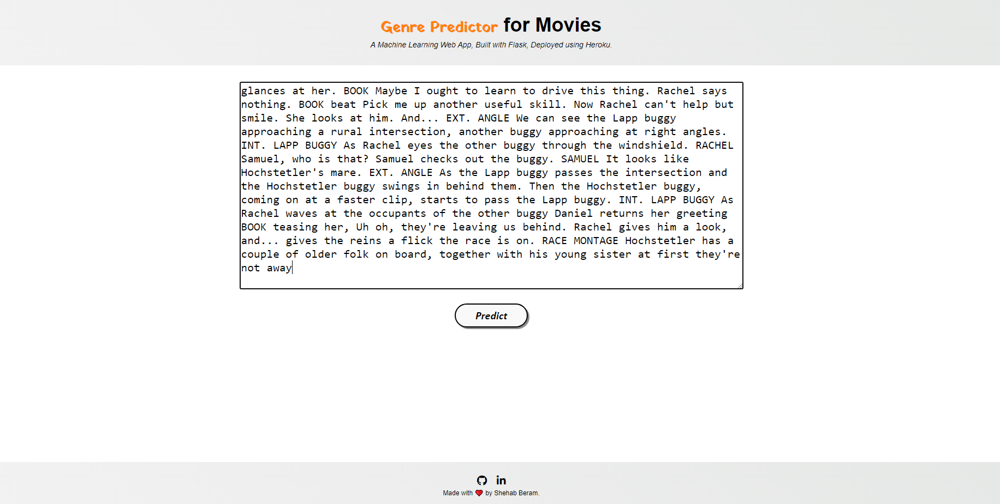
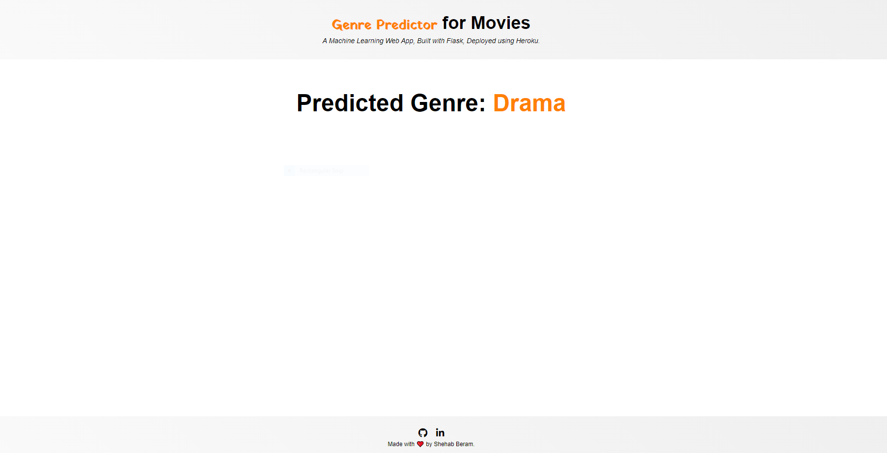
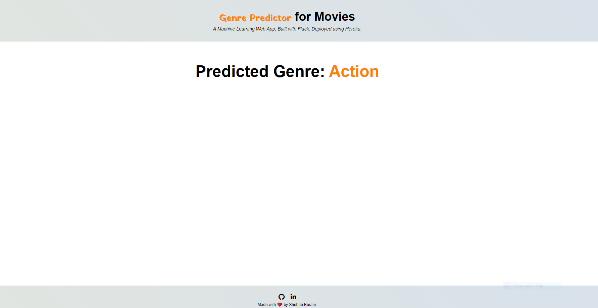

# Movie Genre Classification 
  

• A web application that utilizes machine learning and a dataset that consists of 22,579 records to predict the genre of a movie from just 1000 characters of the script.

• A glimpse of the web app:

 

 

